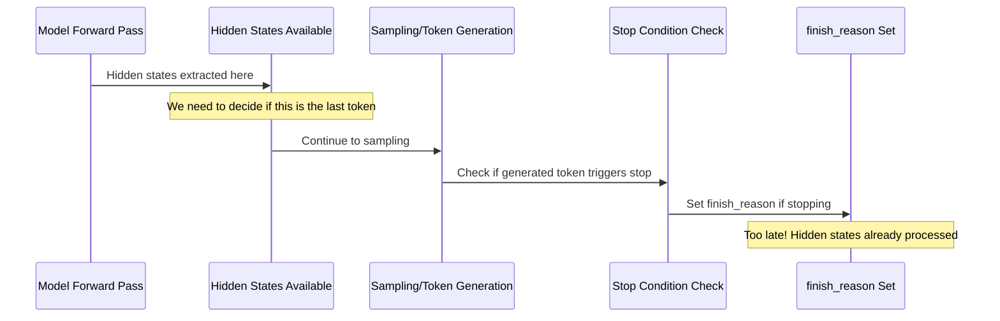

# Hidden States Design - Alternative Approaches (Archive)

This document contains the alternative approaches that were considered for implementing hidden states support in vLLM v1. These have been moved here for reference while the final design uses the Post-Sampling Prefill Strategy.

## The "Last Token" Problem

The "last token" problem is central to hidden states extraction: **we need to return hidden states for the final token of a sequence, but the timing of when we extract hidden states vs when we know a token is "final" creates a coordination challenge.**

### The Core Timing Challenge

**The Problem:**
1. **Hidden states extraction** happens during model forward pass (`gpu_model_runner.py:1208-1213`)
2. **Token generation** happens via sampling after the forward pass (`gpu_model_runner.py:1257-1286`) 
3. **Stop condition checking** happens after token generation (`scheduler.py:766` → `utils.py:5-22`)
4. **`finish_reason` gets set** only after we know the generated token



## Alternative Solution Approaches (Archived)

### **Approach 1: Pre-Sampling Stop Prediction**

Predict which requests will finish **before** the model forward pass for deterministic stop conditions.

```python
def predict_last_tokens(self, scheduler_output: "SchedulerOutput") -> set[str]:
    """Predict which requests will finish after this generation step."""
    last_token_req_ids = set()
    
    for req_id in self.input_batch.req_ids:
        request = self.requests[req_id]
        
        # Predictable: Length-based stopping
        will_hit_max_tokens = (request.num_output_tokens + 1 >= request.max_tokens)
        will_hit_max_model_len = (request.num_tokens + 1 >= self.max_model_len)
        
        if will_hit_max_tokens or will_hit_max_model_len:
            last_token_req_ids.add(req_id)
    
    return last_token_req_ids

# In gpu_model_runner.py execute_model()
predicted_last_tokens = self.predict_last_tokens(scheduler_output)
# Pass this information to hidden states extraction logic
```

**Pros:** Efficient, no speculation needed for length-based stops  
**Cons:** Cannot predict content-based stops (EOS tokens, stop strings)

### **Approach 2: Speculative Hidden States Extraction**

Extract hidden states for **all requests that might stop**, then filter after sampling.

```python
def analyze_potential_stops(self, scheduler_output) -> dict[str, str]:
    """Identify requests that might stop and why."""
    potential_stops = {}
    
    for req_id in self.input_batch.req_ids:
        request = self.requests[req_id]
        
        # Definite stops (length-based)
        if (request.num_output_tokens + 1 >= request.max_tokens or
            request.num_tokens + 1 >= self.max_model_len):
            potential_stops[req_id] = "definite_length"
        
        # Possible stops (content-based)
        elif (request.eos_token_id is not None or 
              request.sampling_params.stop_token_ids):
            potential_stops[req_id] = "possible_content"
    
    return potential_stops

# Extract hidden states for all potential stops, filter post-sampling
```

**Pros:** Handles all stop conditions  
**Cons:** May extract unnecessary hidden states (memory overhead)

### **Approach 3: Post-Sampling Hidden States Retrieval**

Modify the forward pass to **retain** hidden states, then extract them after we know which tokens are final.

```python
# Store hidden states during forward pass
class HiddenStatesBuffer:
    def __init__(self, max_tokens: int, hidden_size: int):
        self.buffer = torch.zeros((max_tokens, hidden_size), device="cuda")
        self.req_id_to_indices = {}
    
    def store(self, req_id: str, token_idx: int, hidden_states: torch.Tensor):
        self.buffer[token_idx] = hidden_states
        if req_id not in self.req_id_to_indices:
            self.req_id_to_indices[req_id] = []
        self.req_id_to_indices[req_id].append(token_idx)
    
    def extract_last_tokens(self, finished_req_ids: set[str]) -> dict[str, torch.Tensor]:
        last_states = {}
        for req_id in finished_req_ids:
            if req_id in self.req_id_to_indices:
                last_idx = self.req_id_to_indices[req_id][-1]
                last_states[req_id] = self.buffer[last_idx].clone()
        return last_states

# In gpu_model_runner.py
hidden_states_buffer.store_all(hidden_states)  # Store during forward pass
sampler_output = self.sampler(logits, sampling_metadata)  # Sample tokens
finished_reqs = self.identify_finished_requests(sampler_output)  # Check stops
last_hidden_states = hidden_states_buffer.extract_last_tokens(finished_reqs)
```

**Pros:** Accurate, handles all stop conditions  
**Cons:** Memory overhead, requires modification to model forward pass

### **Approach 4: Enhanced Forward Context with Hybrid Strategy**

Combine predictive and speculative approaches based on stop condition type.

```python
@dataclass
class HiddenStatesExtractionPlan:
    definite_last_tokens: set[str]  # Length-based, we know for sure
    speculative_extractions: set[str]  # Content-based, extract speculatively
    no_extraction_needed: set[str]  # Won't stop this iteration

def create_extraction_plan(self, scheduler_output) -> HiddenStatesExtractionPlan:
    """Create a plan for which requests need hidden states extraction."""
    definite_last = set()
    speculative = set()
    no_extraction = set()
    
    for req_id in self.input_batch.req_ids:
        request = self.requests[req_id]
        
        # Check if request wants hidden states
        if not request.return_hidden_states:
            no_extraction.add(req_id)
            continue
        
        # Definite last token (length-based)
        if (request.num_output_tokens + 1 >= request.max_tokens or
            request.num_tokens + 1 >= self.max_model_len):
            definite_last.add(req_id)
        
        # Possible last token (content-based)
        elif (request.eos_token_id is not None or 
              request.sampling_params.stop_token_ids):
            speculative.add(req_id)
        
        # Won't stop this iteration
        else:
            no_extraction.add(req_id)
    
    return HiddenStatesExtractionPlan(
        definite_last_tokens=definite_last,
        speculative_extractions=speculative,
        no_extraction_needed=no_extraction
    )

# Usage in gpu_model_runner.py
def execute_model(self, scheduler_output):
    extraction_plan = self.create_extraction_plan(scheduler_output)
    
    # Set extraction context
    with set_hidden_states_context(extraction_plan):
        model_output = self.model(...)
    
    # Post-sampling: filter speculative extractions
    sampler_output = self.sampler(logits, sampling_metadata)
    actual_stops = self.identify_actual_stops(sampler_output)
    
    # Build final hidden states output
    final_hidden_states = {}
    final_hidden_states.update(model_output.definite_hidden_states)
    
    # Filter speculative extractions to only actual stops
    for req_id in actual_stops:
        if req_id in model_output.speculative_hidden_states:
            final_hidden_states[req_id] = model_output.speculative_hidden_states[req_id]
    
    return ModelRunnerOutput(
        # ... existing fields ...
        last_hidden_states=final_hidden_states
    )
```

### Implementation Integration Points (for archived approaches)

1. **`scheduler.py:766`** - Add hidden states context when requests finish
2. **`gpu_model_runner.py:1208-1213`** - Enhance forward pass with extraction planning
3. **`utils.py:5-22`** - Extend `check_stop` to return hidden states extraction info
4. **`forward_context.py`** - Add hidden states extraction planning to context

### Memory and Performance Considerations (for archived approaches)

- **Definite extractions**: Zero waste, extract only what's needed
- **Speculative extractions**: ~10-30% overhead for content-based stops
- **Buffer management**: Reuse pre-allocated buffers for CUDA graph compatibility
- **Cleanup**: Immediately free hidden states memory after ZMQ transfer

## Trade-offs Analysis Between Approaches

| Aspect | Approach 1 | Approach 2 | Approach 3 | Approach 4 | Post-Sampling Prefill |
|--------|------------|------------|------------|------------|----------------------|
| **Accuracy** | 60% (length-based only) | 90% (speculation) | 100% (perfect) | 95% (hybrid) | 100% (perfect knowledge) |
| **Main Loop Impact** | +5% compute | +15% memory | +20% memory | +15% memory, +5% compute | 0% (unchanged) |
| **Additional Cost** | Minimal | Moderate | High | Moderate | +20-50% compute for finished requests |
| **Latency** | No increase | Minimal increase | Moderate increase | Minimal increase | +50-200ms per finished request |
| **Implementation** | Simple | Moderate | Complex | Complex | Moderate (separate prefill) |
| **CUDA Graph** | Compatible | Requires care | Complex | Requires careful design | Main loop unaffected |

---

*These approaches were considered but ultimately the Post-Sampling Prefill Strategy was chosen for the final implementation.*