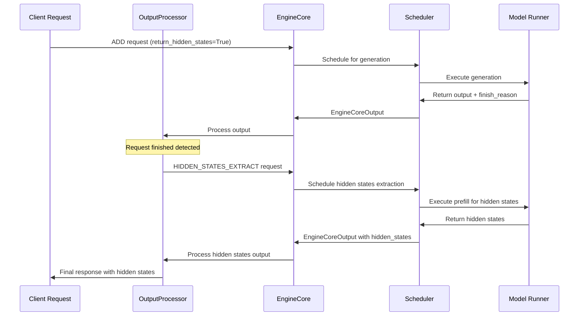

# Hidden States as Core Engine Request Type

## Architectural Approach: New Request Type Strategy

### Core Concept

Treat hidden states extraction as a **first-class request type** in vLLM v1's existing request/response architecture.

```python
class EngineCoreRequestType(enum.Enum):
    ADD = b'\x00'
    ABORT = b'\x01' 
    START_DP_WAVE = b'\x02'
    UTILITY = b'\x03'
    EXECUTOR_FAILED = b'\x04'
    HIDDEN_STATES_EXTRACT = b'\x05'  # NEW
```

### Request Flow Architecture



### Integration Points

#### 1. **Dispatch Point: OutputProcessor**

```python
# In vllm/v1/engine/processor.py (or output_processor.py)
class OutputProcessor:
    
    def process_outputs(self, engine_core_outputs: EngineCoreOutputs):
        for output in engine_core_outputs.outputs:
            # ... existing processing ...
            
            # NEW: Check for finished requests needing hidden states
            if (output.finished and 
                self._needs_hidden_states(output.request_id)):
                self._dispatch_hidden_states_request(output)
    
    def _needs_hidden_states(self, request_id: str) -> bool:
        """Check if request needs hidden states extraction."""
        req_state = self.request_states.get(request_id)
        return (req_state and 
                req_state.request.return_hidden_states and
                req_state.hidden_states is None)  # Not yet extracted
    
    def _dispatch_hidden_states_request(self, output: EngineCoreOutput):
        """Dispatch hidden states extraction request."""
        hidden_states_request = HiddenStatesExtractionRequest(
            request_type=EngineCoreRequestType.HIDDEN_STATES_EXTRACT,
            original_request_id=output.request_id,
            sequence_tokens=self._get_full_sequence(output.request_id),
            target_position=-1,  # Last token
            arrival_time=time.time()
        )
        
        # Send back to engine core for scheduling
        self.engine_core_client.add_request(hidden_states_request)
```

#### 2. **Core Engine Handler**

```python
# In vllm/v1/engine/core.py
class EngineCore:
    
    def _handle_client_request(self, client_request):
        request_type = client_request.request_type
        
        if request_type == EngineCoreRequestType.ADD:
            self._handle_add_request(client_request)
        elif request_type == EngineCoreRequestType.ABORT:
            self._handle_abort_request(client_request)
        # ... existing handlers ...
        elif request_type == EngineCoreRequestType.HIDDEN_STATES_EXTRACT:
            self._handle_hidden_states_extraction(client_request)  # NEW
    
    def _handle_hidden_states_extraction(self, request):
        """Handle hidden states extraction request."""
        # Convert to internal request format for scheduling
        hidden_states_req = self._create_hidden_states_internal_request(request)
        self.scheduler.add_hidden_states_request(hidden_states_req)
```

#### 3. **Scheduler Integration**

```python
# In vllm/v1/core/sched/scheduler.py
class Scheduler:
    
    def __init__(self, ...):
        # ... existing initialization ...
        self.hidden_states_queue = deque()  # NEW: Queue for hidden states requests
    
    def add_hidden_states_request(self, request):
        """Add hidden states extraction request to queue."""
        self.hidden_states_queue.append(request)
    
    def schedule(self, budget: SchedulingBudget) -> SchedulerOutput:
        # ... existing scheduling logic for generation requests ...
        
        # NEW: Schedule hidden states extraction if budget allows
        if budget.can_schedule_hidden_states() and self.hidden_states_queue:
            hidden_states_req = self.hidden_states_queue.popleft()
            return self._schedule_hidden_states_extraction(hidden_states_req, budget)
        
        return self._schedule_generation_requests(budget)
    
    def _schedule_hidden_states_extraction(self, request, budget):
        """Schedule hidden states extraction as a prefill operation."""
        # Treat as a specialized prefill request
        return SchedulerOutput(
            request_ids=[request.original_request_id],
            ignored_request_ids=[],
            num_batched_tokens=len(request.sequence_tokens),
            hidden_states_extraction=request,  # NEW field
            # ... other fields ...
        )
```

#### 4. **Model Runner Execution**

```python
# In vllm/v1/worker/gpu_model_runner.py
class GPUModelRunner:
    
    def execute_model(self, scheduler_output: SchedulerOutput):
        # Check if this is a hidden states extraction request
        if scheduler_output.hidden_states_extraction:
            return self._execute_hidden_states_extraction(scheduler_output)
        else:
            return self._execute_generation(scheduler_output)
    
    def _execute_hidden_states_extraction(self, scheduler_output):
        """Execute hidden states extraction via prefill."""
        hs_request = scheduler_output.hidden_states_extraction
        
        # Build input batch for prefill
        input_batch = self._build_hidden_states_input_batch(hs_request)
        
        # Execute prefill with hidden states extraction enabled
        with self._hidden_states_extraction_context():
            model_output = self.model(
                input_ids=input_batch.input_ids,
                positions=input_batch.positions,
                kv_caches=input_batch.kv_caches,
                attn_metadata=input_batch.attn_metadata,
                extract_hidden_states=True,  # NEW parameter
                target_positions=[hs_request.target_position]
            )
        
        # Extract the specific hidden states needed
        hidden_states = model_output.hidden_states[hs_request.target_position]
        
        return ModelRunnerOutput(
            req_ids=[hs_request.original_request_id],
            req_id_to_index={hs_request.original_request_id: 0},
            sampled_token_ids=[],  # No new tokens generated
            hidden_states={hs_request.original_request_id: hidden_states},  # NEW
            # ... other fields ...
        )
```

### Request Data Structure

```python
@dataclass
class HiddenStatesExtractionRequest:
    """Request for extracting hidden states from a completed sequence."""
    
    request_type: EngineCoreRequestType  # HIDDEN_STATES_EXTRACT
    original_request_id: str
    sequence_tokens: list[int]  # Full sequence: prompt + generated tokens
    target_position: int  # Position to extract (-1 for last token)
    layer_indices: Optional[list[int]] = None  # Specific layers (default: final layer)
    arrival_time: float = 0.0
    
    # Optional: for future extensibility
    extract_all_positions: bool = False
    custom_extraction_config: Optional[dict] = None
```

### Key Architectural Benefits

#### 1. **Async by Design**
- Hidden states extraction doesn't block main generation
- Can be scheduled when resources are available
- Natural backpressure if extraction queue builds up

#### 2. **Clean Separation**
- Main generation logic completely unchanged
- Hidden states extraction isolated as separate concern
- Easy to test, debug, and optimize independently

#### 3. **Leverages Existing Infrastructure**
- Uses existing request queuing and scheduling
- Fits naturally into ZMQ communication patterns
- Reuses batch processing and memory management

#### 4. **Flexible Scheduling**
- Can prioritize generation over hidden states extraction
- Can batch multiple hidden states requests together
- Can defer extraction to low-utilization periods

#### 5. **Future Extensibility**
- Framework for other post-processing operations
- Can add features like caching, compression, etc.
- Easy to add configuration options

### Implementation Phases

#### Phase 1: Basic Infrastructure
- [ ] Add `HIDDEN_STATES_EXTRACT` request type
- [ ] Create `HiddenStatesExtractionRequest` data structure
- [ ] Add handler in `EngineCore`
- [ ] Basic dispatch from `OutputProcessor`

#### Phase 2: Scheduling Integration
- [ ] Add hidden states queue to `Scheduler`
- [ ] Implement scheduling logic for hidden states requests
- [ ] Add budget management for mixed workloads

#### Phase 3: Model Execution
- [ ] Modify `GPUModelRunner` to handle hidden states requests
- [ ] Implement prefill logic for hidden states extraction
- [ ] Add model parameter for conditional extraction

#### Phase 4: Response Handling
- [ ] Update output processing to include hidden states
- [ ] Modify client response formatting
- [ ] Add error handling and timeout logic

### Performance Characteristics

#### Latency Impact
- **Generation requests**: No impact (main path unchanged)
- **Hidden states requests**: +1 additional prefill pass per request
- **Overall system**: Depends on hidden states request frequency

#### Throughput Impact
- **Low hidden states usage** (<20%): Minimal impact
- **High hidden states usage** (>50%): May need dedicated resources
- **Mitigation**: Smart scheduling and resource allocation

#### Memory Usage
- **Peak memory**: Original batch + hidden states extraction batch
- **Duration**: Temporary during extraction only
- **Optimization**: Reuse buffers, immediate cleanup

This architecture elegantly solves the "last token" problem by treating hidden states extraction as a natural extension of vLLM v1's request-based architecture.